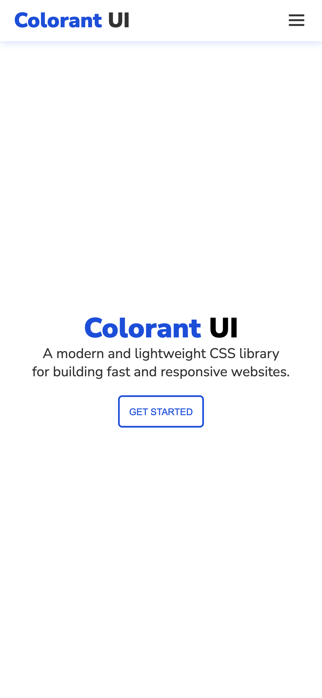
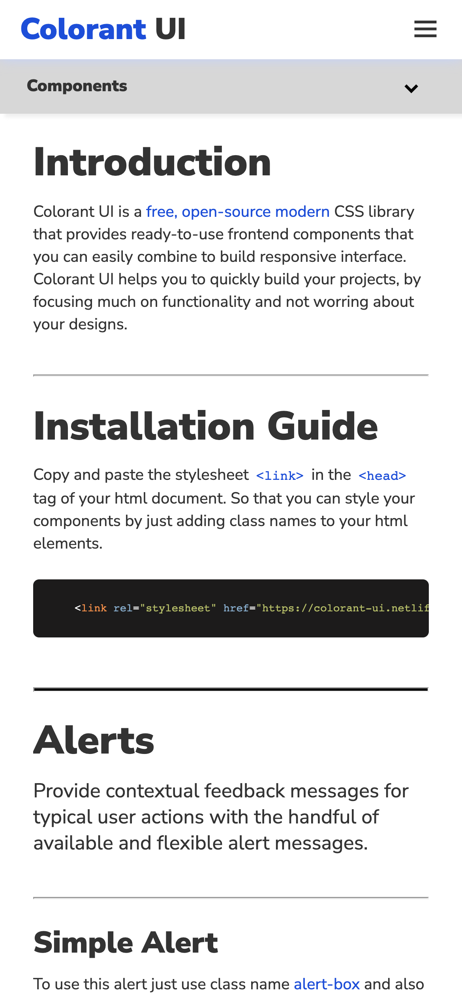

# [Colorant UI](https://hue-ui.vercel.app/)

A modern and lightweight CSS library
for building fast and responsive websites. ✨

<br/>

## **Table of contents**

- [Installation](#installation)
- [Documentation](#documentation)
- [Screenshot](#screenshot)
- [Technologies used](#technologies-used)
- [Author](#author)

<br/>

## **Installation**

<br/>

Copy and paste the stylesheet `<link>` in the `<head>` tag of your html document. So that you can style your components by just adding class names to your html elements.

```html
 <link rel="stylesheet" href="https://colorant-ui.netlify.app/CSS/main.css">
```

<br/>

## **Documentation**

<br/>

Check out our **[documentation website](https://colorant-ui.netlify.app/docsite.html)**.

<br/>

## **Screenshot**

<br/>

 <br/> <br/>

 <br/> <br/>

 <br/> <br/>



<br/>

## **Technologies used**

<br/>

- HTML5
- CSS3
- VanillaJS
- Flexbox
- Grid

<br/>

## **Author**

<br/>

- **Portfolio** - [Aman Singh](https://amansingh.netlify.app)
- **Twitter** - [@aman11s](https://twitter.com/aman11s)
- **LinkedIn** - [aman11s](https://www.linkedin.com/in/aman11s)

<br/>

### **Live project link:**  [Click here](https://colorant-ui.netlify.app)

<br/>

### If you like this repository please give it a ⭐ in the top right corner. 😊